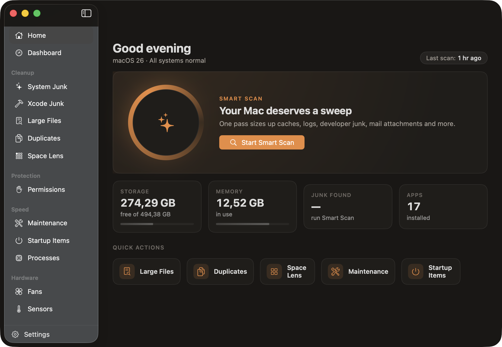

<div align="center">


# TidyMac

**A native macOS cleanup, monitoring and fan-control app — written in SwiftUI.**

[](https://github.com/orbitextechlab/TidyMac/releases/latest)
[](LICENSE)
[](#requirements)
[](https://github.com/orbitextechlab/TidyMac/actions/workflows/ci.yml)



</div>

## Install

**[Download the latest release](https://github.com/orbitextechlab/TidyMac/releases/latest)**, open
the `.dmg`, and drag TidyMac into your Applications folder.

Or from the command line:

```bash
gh release download --repo orbitextechlab/TidyMac --pattern '*.dmg'
hdiutil attach TidyMac-*.dmg
cp -R /Volumes/TidyMac/TidyMac.app /Applications/
hdiutil detach /Volumes/TidyMac
xattr -dr com.apple.quarantine /Applications/TidyMac.app
```

Without `gh`, the same thing with `curl`:

```bash
curl -fsSL -o TidyMac.dmg \
  "$(curl -fsSL https://api.github.com/repos/orbitextechlab/TidyMac/releases/latest \
     | grep -o 'https://[^"]*\.dmg')"
```

Every release also ships a `.zip` of the app bundle, which is easier to unpack in
a script than mounting a disk image, plus a `SHA256SUMS.txt` you can check with
`shasum -a 256 -c SHA256SUMS.txt`.

### macOS will refuse to open it at first

Releases are **ad-hoc signed and not notarized** — notarization requires a paid
Apple Developer ID, which this project does not have. macOS therefore quarantines
the download and reports the app as damaged or from an unidentified developer.
Clearing the quarantine flag is what fixes it:

```bash
xattr -dr com.apple.quarantine /Applications/TidyMac.app
```

That command is not a workaround for a broken app; it tells macOS you accept that
the binary is not signed by a registered developer. If you would rather not take
that on trust, [build it from source](#building) — the result is identical and
never gets quarantined.

## What it does

TidyMac reclaims disk space, surfaces what your Mac is actually doing, and gives
you direct control over the fans. One window, no subscription, no telemetry.

### Cleanup

**Smart Scan** makes a single pass over every cleanup category and reports what
it found before touching anything. Nothing is ever deleted without you selecting
it first.

| Category | What it collects |
|---|---|
| User Caches | `~/Library/Caches` |
| Application Logs | `~/Library/Logs` |
| Crash Reports | Diagnostic reports left by crashed apps |
| Xcode Junk | DerivedData, device support, simulator caches |
| Developer Caches | npm / gradle / CocoaPods — re-downloaded on demand |
| Mail Downloads | Local copies of attachments still on the mail server |
| Xcode Archives | Archives with dSYMs — needed to symbolicate shipped builds |
| iOS Backups | Device backups |
| Old Downloads | Files in `~/Downloads` untouched for 30+ days |
| Trash | Emptying deletes permanently |

Categories that can destroy something you still want carry an explicit warning
in the UI and are never selected by default.

Alongside Smart Scan there are focused tools:

- **Large Files** — walk any folder (your home directory by default) and rank what is taking up the most space
- **Duplicates** — groups by size first, then confirms with a streaming SHA-256, so identical-size-but-different files are not reported as duplicates
- **Space Lens** — treemap of where the space actually went
- **Uninstaller** — removes an app *and* the support files it leaves behind

### Speed

- **Maintenance** — purge inactive RAM, flush the DNS cache, reindex Spotlight,
  thin local Time Machine snapshots, empty the Trash. Each task states plainly whether
  it needs administrator rights.
- **Startup Items** — see and disable what launches at login
- **Processes** — live CPU and memory per process

### Hardware

- **Fans** — read current RPM and drive fans manually or from a temperature
  ramp. Every target RPM is clamped to the range the fan itself reports, so
  TidyMac cannot ask the hardware for a speed it does not support.
- **Sensors** — temperatures and power readings straight from the SMC

### Protection

- **Permissions** — a readable view of what TidyMac needs and why, including
  Full Disk Access

## Requirements

- macOS 14.0 (Sonoma) or later
- Xcode 15 or later to build
- [XcodeGen](https://github.com/yonaskolb/XcodeGen) — the `.xcodeproj` is
  generated from `project.yml` and is not committed

Developed and tested on Apple Silicon. Intel Macs use different SMC keys for
fan and sensor data; those paths are untested and reports are welcome.

## Building

```bash
git clone https://github.com/orbitextechlab/TidyMac.git
cd TidyMac
brew install xcodegen
xcodegen generate
open TidyMac.xcodeproj
```

Or from the command line:

```bash
xcodebuild -project TidyMac.xcodeproj -scheme TidyMac -configuration Release build
```

The project is configured for **ad-hoc signing** (`CODE_SIGN_IDENTITY = "-"`) so
it builds on any machine without a Developer ID. That also means a build you
hand to someone else is not notarized, and macOS Gatekeeper will refuse to open
it on first launch — right-click the app and choose **Open** to get the override
dialog. If you have a Developer ID, set it in `project.yml` and regenerate.

## How the privileged parts work

TidyMac is **not sandboxed**. It reads the SMC through IOKit, deletes files
outside its own container, and runs a handful of system commands as root. Two
mechanisms are involved, and both are worth understanding before you trust it:

- **`AdminRunner`** wraps `osascript` with administrator privileges. macOS shows
  its own authentication dialog; TidyMac never sees your password.
- **`smc-helper`** is a small command-line tool bundled inside the app that does
  the actual SMC writes. Installing it (optional, from Settings) lets fan
  changes apply without re-authenticating every time.

Writing to the SMC is inherently low-level. The RPM clamping described above is
the safety net, but if you are uncomfortable with an app touching fan control,
simply do not use that section — everything else works without it.

## Architecture

```
Sources/
  TidyMac/
    App/          AppState, Navigation, app entry point
    Views/        One SwiftUI view per sidebar section + shared Components
    Services/
      Cleaner/    CleaningEngine, duplicates, large files, Space Lens, uninstaller
      FanControl/ Fan rules, presets, the control loop
      Monitoring/ Sensor and system metric polling
      Privileged/ AdminRunner, helper install, notifications
      Protection/ Permission checks
      SMC/        SMCKit — IOKit interface to the SMC
      Speed/      Maintenance tasks, processes, startup items
  smc-helper/     Privileged CLI that performs SMC writes
Design/AppIcon/   Icon source (SVG + generator script)
```

Two deliberate choices worth knowing about:

- `Navigation` is a separate `ObservableObject` from `AppState`. `AppState`
  publishes metrics every couple of seconds; anything observing it rebuilds on
  every tick. The navigation shell observes only `Navigation`, so long scrolling
  lists do not hitch.
- The design language lives in `Views/Components/Theme.swift` — warm charcoal
  surfaces, one orange accent, depth from hairline borders and glows rather than
  shadows. Use those tokens instead of hard-coding colors.

## Contributing

Bug reports and pull requests are welcome. See [CONTRIBUTING.md](CONTRIBUTING.md).

## License

Apache License 2.0 — see [LICENSE](LICENSE).

TidyMac deletes files and writes to hardware control registers. It ships without
warranty of any kind, as stated in the license. Read what a scan found before
you clean it.
